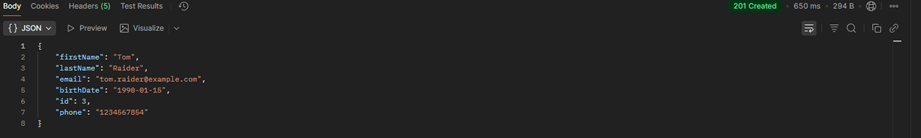
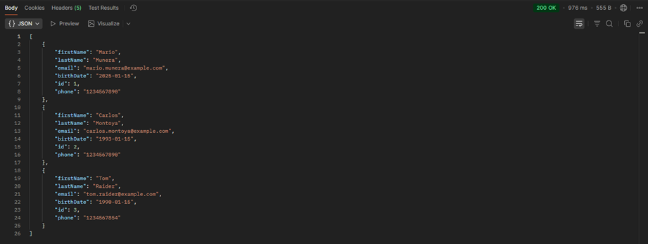
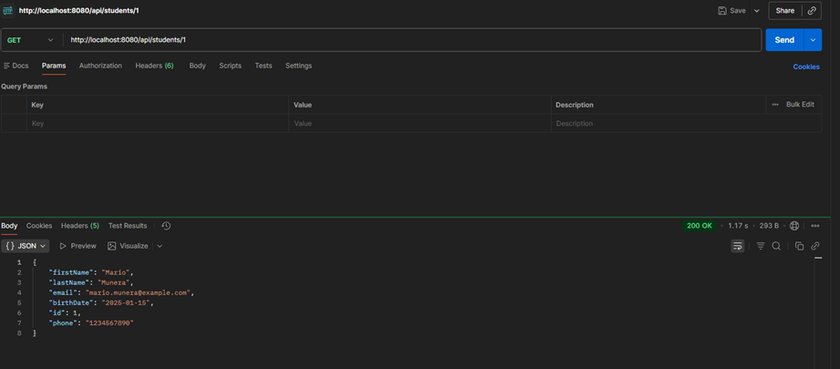
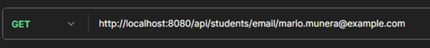
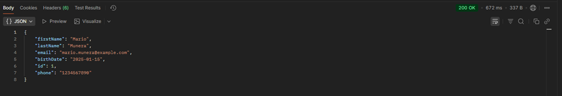
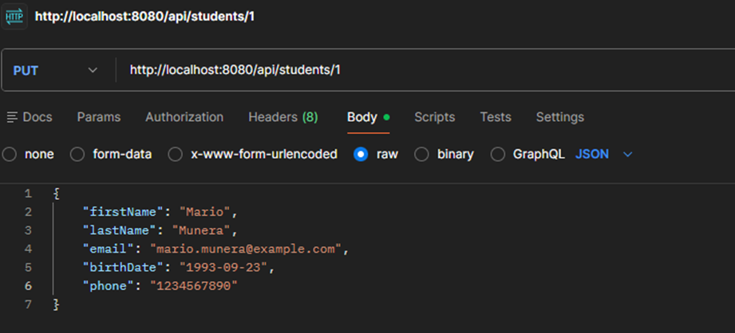
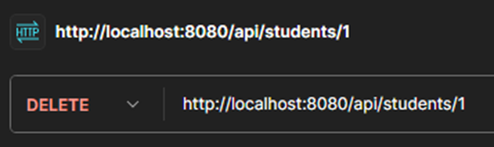
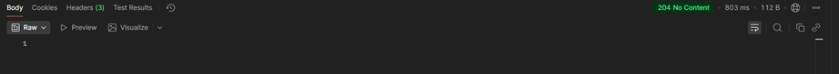
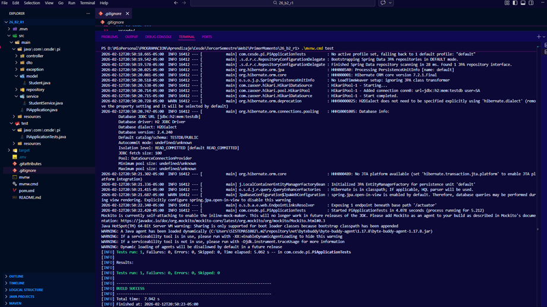

# Actividad 1 - Backend 2 (Miércoles)
**Nombre Completo:** Mario Alosno Munera Velez
**Institución:** Cesde

---

## 1. Instancia de Base de Datos
* **Enlace a la instancia:** [Prisma Studio - Base de Datos](https://console.prisma.io/cmliquj9500nlyhd2q763dvot/cmlirulmt006y4tfllveikoiy/cmlirulmt006w4tfl2obrd8rw/studio#table=students&schema=public&view=table?)

* **Configuración de Base de Datos:**

* **Configuración en Prisma.io:**
    postgres://f4a750c27d9e832c7c2432a4f3e8c4077aa13bf7320411518709ea95130519b6:@db.prisma.io:5432/postgres?sslmode=require
    *(Nota: Asegúrate de que se vea la URL y el host, ocultando la contraseña)*

---

## 2. Conexión desde Spring Boot

---

## 3. Pruebas de la API (CRUD)

### [POST] Crear Registro
*Captura de la solicitud (Request) y la respuesta (Response) en Postman/Insomnia:*

### [GET] Obtener Todos (All)

### [GET] Obtener por ID

### [GET] Obtener por Email

### [PUT] Actualizar Registro

### [DELETE] Eliminar Registro

---

## 4. Pruebas Internas del Proyecto

> **Estado final:** Todas las pruebas pasaron exitosamente.

---
*Este repositorio es un fork del proyecto original para la asignatura de Backend 2.*